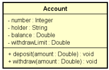

## Simulador de Conta Bancária

### Descrição
Este programa simula uma conta bancária básica, permitindo realizar operações de saque e depósito. O sistema verifica se o valor do saque é válido, considerando o saldo disponível e o limite da conta.

### Funcionalidades
* **Criação de Conta:** Permite criar uma nova conta bancária com número, titular, saldo inicial e limite de saque.
* **Depósito:** Permite realizar depósitos em uma conta existente.
* **Saque:** Permite realizar saques, verificando se há saldo suficiente e se o valor não excede o limite.
* **Exibição de Saldo:** Exibe o saldo atual da conta.

### Como Usar
1. **Executar o Programa:** Rode o script Python em seu ambiente de desenvolvimento.
2. **Criar uma Conta:** Forneça os dados da conta (número, titular, saldo inicial, limite).
3. **Realizar Operações:** Utilize as funções para realizar depósitos e saques.
4. **Verificar Saldo:** Consulte o saldo atual da conta a qualquer momento.

### Diagram da classe - UML
